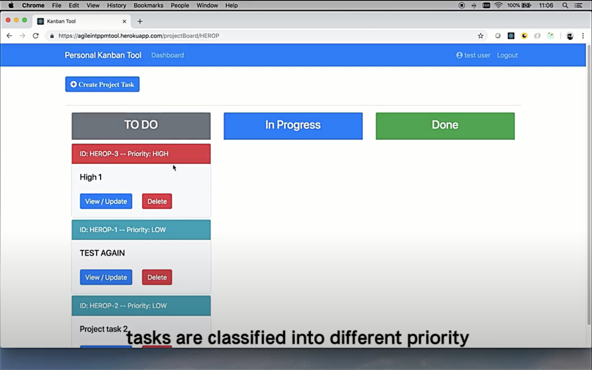

# Personal Project Management Tool
## Quick View
1. For a quick view, click the following picture which will route you to YouTube
   
2. Thebackend part use spring framework
3. the frontend use react+redux
   